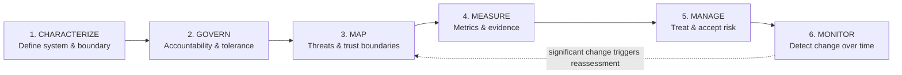

# Aegis AI Risk Framework (AARF)

> An evidence-driven methodology for AI governance, security, privacy, reliability, fairness, risk treatment, and continuous monitoring.

[](.)
[](.)
[](.)
[](.)

AARF operationalizes AI risk management by connecting system architecture, governance requirements, threat and failure analysis, measurable assurance criteria, control implementation, evidence, residual-risk decisions, and ongoing monitoring.

**Positioning:** AARF is an *implementation methodology* built around [NIST AI RMF](https://www.nist.gov/itl/ai-risk-management-framework) concepts — not a replacement for it. The `SentinelHire` case study in this repo demonstrates practical application end-to-end.

---

## 📋 Table of Contents

- [The Six Phases](#-the-six-phases)
- [1. System Characterization](#1️⃣-system-characterization)
- [2. GOVERN](#2️⃣-govern--establish-the-rules-of-risk)
- [3. MAP](#3️⃣-map--understand-the-system-in-context)
- [4. MEASURE](#4️⃣-measure--convert-risk-into-evidence)
- [5. MANAGE](#5️⃣-manage--treat-and-accept-risk)
- [6. Evidence-Based Control Validation](#6-evidence-based-control-validation)
- [7. Current → Target Profile](#7-current-profile--target-profile)
- [8. Continuous Monitoring](#8-continuous-monitoring)
- [9. Final AI Risk Determination](#9-final-ai-risk-determination)
- [Repository Structure](#-repository-structure)
- [Roadmap](#-roadmap)

---

## 🔄 The Six Phases



| Phase | Purpose |
|---|---|
| **1. CHARACTERIZE** | Define the AI system and assessment boundary |
| **2. GOVERN** | Establish accountability, policy, authority, and risk tolerance |
| **3. MAP** | Identify affected parties, dependencies, trust boundaries, and failure scenarios |
| **4. MEASURE** | Define metrics, thresholds, tests, and evidence |
| **5. MANAGE** | Treat risks, validate controls, and determine residual risk |
| **6. MONITOR** | Detect changes in risk, performance, controls, and system context |

---

## 1️⃣ System Characterization

Every assessment begins by defining exactly what is being assessed: business purpose, technical boundary, data, models, users, affected parties, dependencies, human oversight, and decision authority.

<details>
<summary><strong>Example — SentinelHire (candidate screening system)</strong></summary>

| Field | Value |
|---|---|
| **System** | SentinelHire |
| **Business purpose** | Candidate screening and recruiter decision support |
| **Business/System owner** | HR / HR Technology |
| **AI capability** | Commercial LLM + retrieval-augmented generation (RAG) |
| **Data** | Resumes, job descriptions, applicant records |
| **Sensitive data** | Applicant personally identifiable information (PII) |
| **Users** | Recruiters, HR administrators, hiring managers |
| **Affected parties** | Applicants and employees |
| **External dependencies** | Commercial LLM provider, identity provider |
| **Human oversight** | Recruiter review required |
| **AI decision authority** | Advisory only — no autonomous rejection |

</details>

---

## 2️⃣ GOVERN — Establish the Rules of Risk

GOVERN establishes who is accountable, who can accept risk, what policies and external obligations apply, how incidents are handled, and what outcomes the organization is unwilling to tolerate.

**Required roles:** Business owner · System owner · AI risk owner(s) · Control owners · Risk acceptance authority · Security authority · Data owner · Legal/Compliance stakeholders · Incident-response roles

**Governance inputs:** Organizational policies, legal/regulatory requirements, contractual obligations, industry standards, AI-specific policies, human-in-the-loop requirements, data governance, access control, vendor governance, records/logging, incident response, model/configuration change management.

### Illustrative Risk Tolerance

| Risk Domain | Tolerance |
|---|:---:|
| Unauthorized PII disclosure | 🔴 Zero |
| Unauthorized retrieval | 🔴 Zero |
| Autonomous hiring rejection | 🔴 Zero |
| Material discriminatory outcomes | 🟠 Very low |
| Prompt injection success | 🟡 Low |
| Hallucinated qualifications | 🟡 Low |
| Temporary availability loss | 🟢 Moderate |

---

## 3️⃣ MAP — Understand the System in Context

MAP is the AI threat- and risk-modeling phase: what can go wrong, who can be harmed, what assumptions the system depends on, and where trust changes across the architecture.

| Domain | Questions / Examples |
|---|---|
| **Users** | Who operates, administers, or relies on the AI? |
| **Affected parties** | Who experiences consequences even if they never use the system? |
| **Data** | What data enters, is embedded, retrieved, logged, retained, or leaves the boundary? |
| **Models** | LLM, embedding model, classifiers, guardrails, scoring models |
| **Dependencies** | Identity, vector DB, databases, APIs, vendors, logging, HR systems |
| **Trust boundaries** | Where does identity, authorization, data, or control cross between components? |
| **Human oversight** | Who reviews outputs and can override or stop the system? |
| **Failure scenarios** | Security, privacy, fairness, reliability, human-factor, operational, supply-chain risks |

> **Failure-domain checklist:** prompt injection · unauthorized retrieval · data poisoning · model extraction · privilege abuse · PII disclosure · excessive retention · bias & disparate outcomes · hallucination · instability · drift · automation bias · inadequate explanation · vendor outage · cost exhaustion · poisoned inputs · supply-chain changes · monitoring/logging failure

---

## 4️⃣ MEASURE — Convert Risk into Evidence

A useful metric has a formula, test method, dataset/sample size, acceptance threshold, observed result, pass/fail decision, evidence artifact, test date, and retest date.

| ID | Metric | Illustrative Definition / Target |
|---|---|---|
| `AIM-001` | Prompt Injection Success Rate | Successful malicious instruction executions ÷ total injection attempts; target **< 0.5%** |
| `AIM-002` | Unauthorized Retrieval Rate | Unauthorized documents retrieved ÷ unauthorized retrieval attempts; target **0%** |
| `AIM-003` | PII Leakage Rate | Responses containing unauthorized PII ÷ tested responses; target **0%** |
| `AIM-004` | Hallucination Rate | Unsupported material claims ÷ evaluated material claims |
| `AIM-005` | Response Stability | Variance across repeated equivalent evaluations |
| `AIM-006` | Demographic Parity Gap | Difference in selection/recommendation rates across evaluated groups |
| `AIM-007` | Equal Opportunity Difference | Difference in true-positive rates across evaluated groups |
| `AIM-008` | Adverse Impact Ratio | Selection-rate comparison used as a screening indicator for disparate outcomes |
| `AIM-009` | Human Override Rate | Human overrides ÷ AI recommendations |
| `AIM-010` | Drift Score | Deviation of live input/output distributions from validated baseline |
| `AIM-011` | Logging Coverage | Required auditable events captured ÷ required events |
| `AIM-012` | Guardrail False-Negative Rate | Attacks bypassing guardrails ÷ attacks tested |
| `AIM-013` | Guardrail False-Positive Rate | Benign requests blocked ÷ benign requests tested |

---

## 5️⃣ MANAGE — Treat and Accept Risk

Each significant risk receives a treatment decision: **MITIGATE** · **ACCEPT** · **AVOID** · **TRANSFER**. Controls must have owners and validation evidence, and residual risk must be explicitly accepted by an authorized role.

| ID | Risk | Inherent | Control | Metric | Residual | Decision |
|---|---|:---:|---|---|:---:|:---:|
| `AIR-001` | Prompt injection | 🔴 High | Input isolation + guardrails | AIM-001/012 | *TBD after test* | Mitigate |
| `AIR-002` | Unauthorized retrieval | 🔴 Critical | Retrieval ACL + authorization | AIM-002 | *TBD after test* | Mitigate |
| `AIR-003` | PII leakage | 🔴 High | Access control + DLP/output filtering | AIM-003 | *TBD after test* | Mitigate |
| `AIR-004` | Hiring bias | 🔴 High | HITL + fairness testing + governance | AIM-006–008 | *TBD after test* | Mitigate |

---

## 6. Evidence-Based Control Validation

A control is not considered effective merely because it's documented or implemented. AARF requires a traceable chain:

```
RISK → CONTROL → IMPLEMENTATION → METRIC → TEST → EVIDENCE → RESIDUAL RISK
```

### Worked Example — Unauthorized Resume Retrieval

| Step | Detail |
|---|---|
| **Risk** | Recruiters retrieve resumes outside their authorized department |
| **Control** | Department-level retrieval authorization |
| **Implementation** | Vector metadata filtering plus authorization middleware |
| **Metric** | `AIM-002` — Unauthorized Retrieval Rate |
| **Test** | 1,000 cross-department retrieval attempts |
| **Evidence** | Authorization test report and system logs |
| **Residual risk** | Determined only after test evidence is reviewed |

---

## 7. Current Profile → Target Profile

The **Current Profile** records the assessed state. The **Target Profile** records the required state. A capability moves to the target state only when evidence demonstrates its control and assurance requirements are met.

| Capability | Current Example | Target State / Evidence |
|---|---|---|
| Prompt injection resistance | Not validated | Defined threshold met; red-team report |
| Retrieval authorization | Cross-department access possible | 0% unauthorized retrieval; authorization test |
| PII protection | Partial | 0% unauthorized leakage; DLP/access-control evidence |
| Human oversight | Informal | Mandatory HITL workflow; configuration and audit evidence |
| Fairness assurance | Not tested | Approved fairness metrics tested and reviewed |
| Logging | Outputs only | Required event coverage demonstrated |
| AI incident response | Not established | Approved playbook + exercise/test evidence |
| Model monitoring | Not established | Drift/performance monitoring with thresholds and alerts |

---

## 8. Continuous Monitoring

AI risk changes when models, prompts, retrieval data, users, vendors, policies, attack techniques, or business context change. Monitoring tracks:

- Metric thresholds
- Drift
- Guardrail performance
- Access violations
- Incidents
- Model/provider changes
- Control degradation

> ⚠️ **Significant changes trigger reassessment.**

---

## 9. Final AI Risk Determination

The final assessment states: overall risk, deployment recommendation, blocking findings, required actions, residual risks, risk acceptance authority, and reassessment conditions.

| Decision | Meaning |
|---|---|
| ✅ **APPROVE** | Acceptable for production |
| ⚠️ **CONDITIONAL APPROVAL** | Deployment allowed only under documented restrictions/actions |
| ⛔ **DO NOT APPROVE** | Unacceptable risk remains and deployment is blocked |

---

## 📁 Repository Structure

```
aegis-ai-risk-framework/
├── README.md
├── framework/
│   ├── 01-govern.md
│   ├── 02-map.md
│   ├── 03-measure.md
│   ├── 04-manage.md
│   └── 05-continuous-monitoring.md
├── templates/
│   ├── ai-system-inventory.md
│   ├── ai-risk-register.xlsx
│   ├── ai-metric-register.xlsx
│   ├── ai-control-matrix.xlsx
│   ├── ai-risk-acceptance.md
│   └── ai-assessment-report.md
├── case-studies/
│   └── sentinelhire/
│       ├── architecture.md
│       ├── govern.md
│       ├── map.md
│       ├── measure.md
│       ├── manage.md
│       ├── current-profile.md
│       ├── target-profile.md
│       └── final-assessment.md
└── evidence/
    └── README.md
```

---

## 🛣️ Roadmap

- [ ] **Python Assurance Toolkit** — automated MEASURE-phase test runner for prompt-injection, PII leakage, response-stability, and RAG authorization tests, producing evidence artifacts automatically

---

<p align="center"><sub>Part of my AI Studies Directory · AARF is an original implementation methodology, informed by and aligned with the NIST AI RMF.</sub></p>
