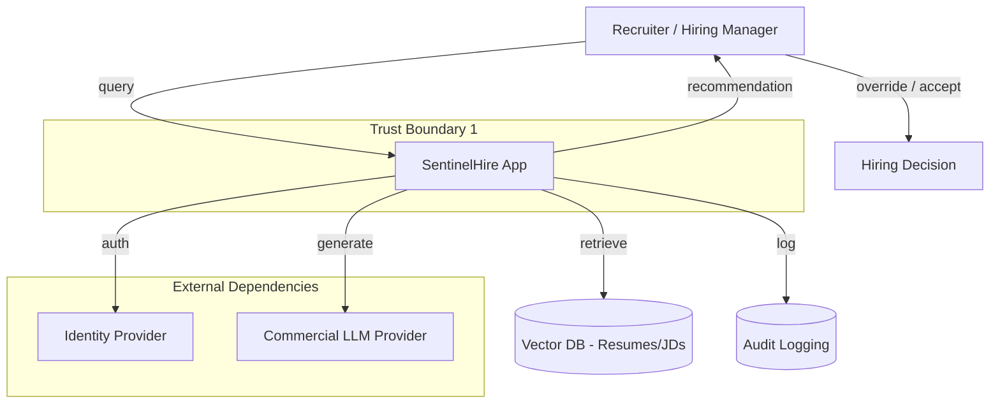

# SentinelHire — System Architecture & Inventory

[← Back to README](../../README.md)

---

This case study demonstrates AARF applied end-to-end to a fictional candidate-screening system, **SentinelHire**.

## System Inventory

| Field | Value |
|---|---|
| **System** | SentinelHire |
| **Business purpose** | Candidate screening and recruiter decision support |
| **Business/System owner** | HR / HR Technology |
| **AI capability** | Commercial LLM + retrieval-augmented generation (RAG) |
| **Data** | Resumes, job descriptions, applicant records |
| **Sensitive data** | Applicant personally identifiable information (PII) |
| **Users** | Recruiters, HR administrators, hiring managers |
| **Affected parties** | Applicants and employees |
| **External dependencies** | Commercial LLM provider, identity provider |
| **Human oversight** | Recruiter review required |
| **AI decision authority** | Advisory only — no autonomous rejection |

## High-Level Architecture

## Trust Boundaries Identified

| Boundary | Crossing | Notes |
|---|---|---|
| User → App | Authentication | Recruiter identity established via IDP |
| App → Vector DB | Data retrieval | Department-level authorization required |
| App → LLM Provider | Data leaves internal boundary | Resume content sent to third-party commercial LLM |
| App → Logging | Audit trail | Must capture retrieval and generation events |
| App → User | Recommendation delivery | Advisory only — human makes final decision |

## Next Steps

Proceed through the case study in order:

1. [GOVERN](govern.md)
2. [MAP](map.md)
3. [MEASURE](measure.md)
4. [MANAGE](manage.md)
5. [Current Profile](current-profile.md)
6. [Target Profile](target-profile.md)
7. [Final Assessment](final-assessment.md)
